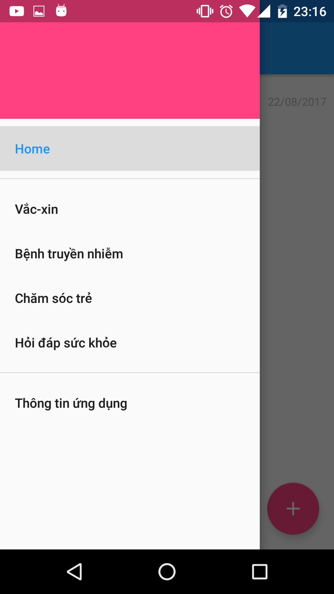
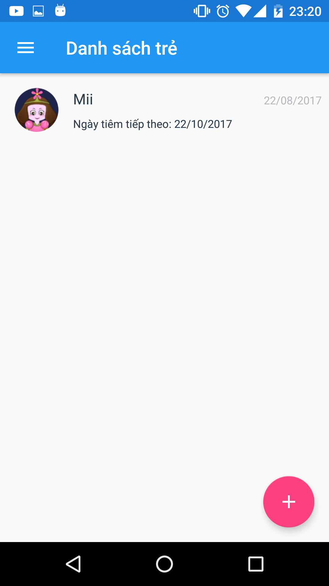
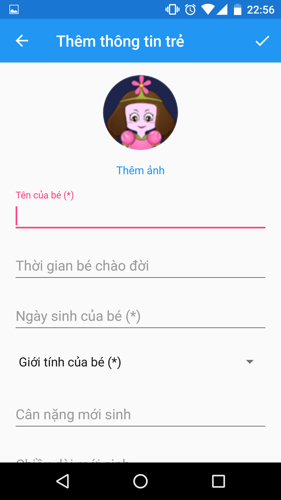
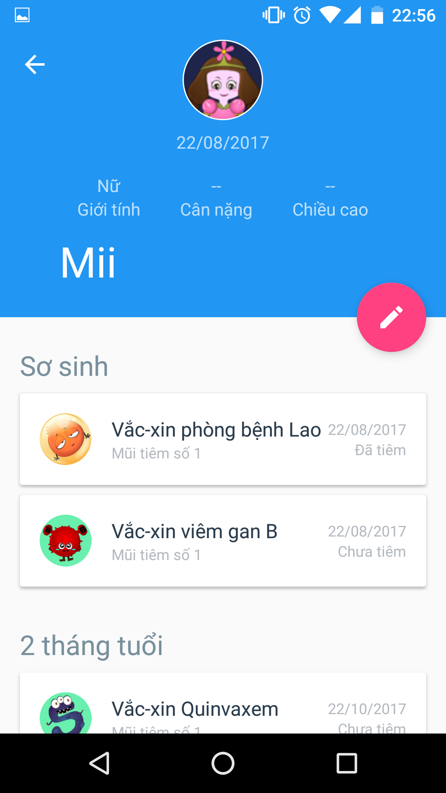
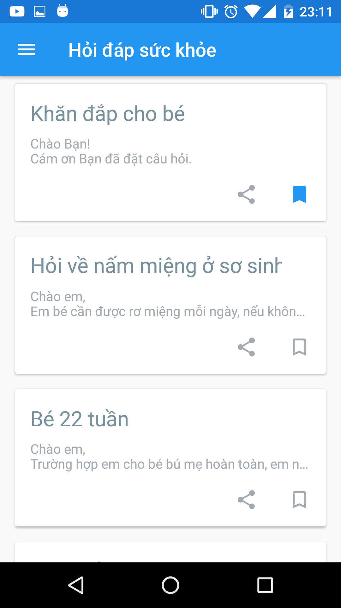

# Vaccines Schedule For Children

### What does this  app do?
This is a mobile vaccine application (app) that will help you manage your baby's vaccination records: 
+ Recommended Immunizations for Child by age
+ Notice of IMMUNIZATIONS NEEDED
+ Update Injection dose steps manually
+ Save Vaccines information that injected
+ Provide more information about vaccines,...

### Screenshots

### Libraries this app uses:

1. Glide Image Loading - https://github.com/bumptech/glide
2. OkHttp - http://square.github.io/okhttp/
3. Jsoup - https://github.com/jhy/jsoup
3. Circle Image View - https://github.com/hdodenhof/CircleImageView